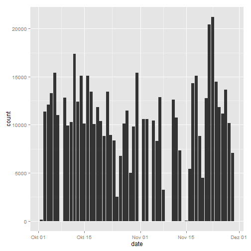
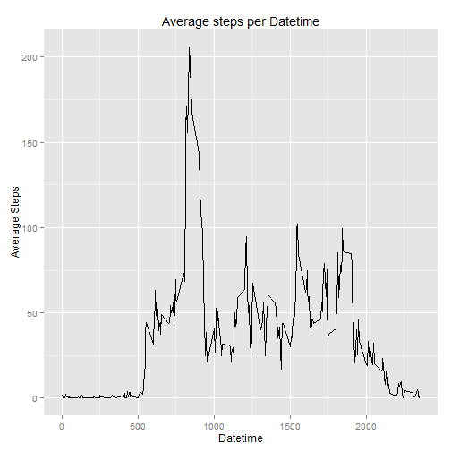
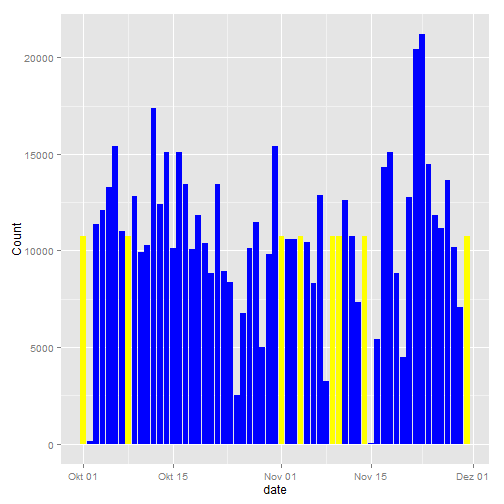
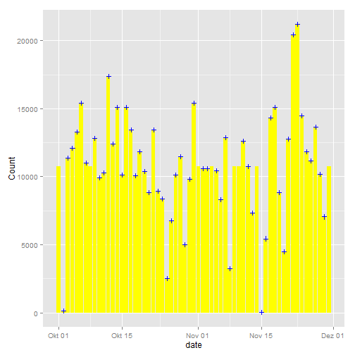
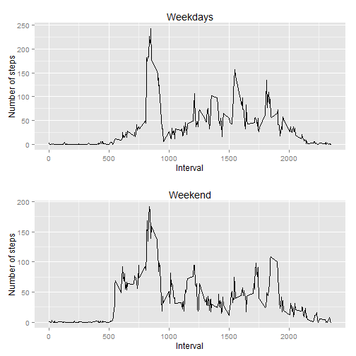

Peer Assignment 1 for the course reproducible research
======================================================


## 0. Reading the data from the activity csv into the variable activity 

```r
setwd("C:/Users/Martin/Documents/Coursera/Reproducible Research")
activity <- read.csv("activity.csv")
activity$date <- as.Date(activity$date, "%Y-%m-%d")
```


## 1. What is mean total number of steps taken per day?

### 1.1. Sum of steps per day

```r
library(ggplot2)
library(dplyr)
sumbyday <-
        activity %>%
        filter(steps != is.na(steps)) %>%
        group_by(date) %>%
        summarise(count = sum(steps))
print(sumbyday)
```

```
## Source: local data frame [53 x 2]
## 
##          date count
## 1  2012-10-02   126
## 2  2012-10-03 11352
## 3  2012-10-04 12116
## 4  2012-10-05 13294
## 5  2012-10-06 15420
## 6  2012-10-07 11015
## 7  2012-10-09 12811
## 8  2012-10-10  9900
## 9  2012-10-11 10304
## 10 2012-10-12 17382
## ..        ...   ...
```

### 1.2. Plotting the steps per day

```r
ggplot(data = sumbyday, aes(x = date, y = count)) + geom_histogram(stat = "identity")
```

 

### 1.3. calculate mean, median and number of steps taken by day

```r
Sum_data <-
        activity %>%
        filter(steps != is.na(steps)) %>%
        group_by(date) %>%
        summarise(Average = mean(steps), Median = median(steps), Count = sum(steps))
print(Sum_data)
```

```
## Source: local data frame [53 x 4]
## 
##          date   Average Median Count
## 1  2012-10-02  63.00000   63.0   126
## 2  2012-10-03 140.14815   61.0 11352
## 3  2012-10-04 121.16000   56.5 12116
## 4  2012-10-05 154.58140   66.0 13294
## 5  2012-10-06 145.47170   67.0 15420
## 6  2012-10-07 101.99074   52.5 11015
## 7  2012-10-09 134.85263   48.0 12811
## 8  2012-10-10  95.19231   56.5  9900
## 9  2012-10-11 137.38667   35.0 10304
## 10 2012-10-12 156.59459   46.0 17382
## ..        ...       ...    ...   ...
```

##2. What is the average daily activity pattern?

### 2.1. Average number of steps by time

```r
timeseries <- 
        activity %>%
        group_by(interval) %>%
        summarise(Average = mean(steps, na.rm = TRUE))
print(timeseries)
```

```
## Source: local data frame [288 x 2]
## 
##    interval   Average
## 1         0 1.7169811
## 2         5 0.3396226
## 3        10 0.1320755
## 4        15 0.1509434
## 5        20 0.0754717
## 6        25 2.0943396
## 7        30 0.5283019
## 8        35 0.8679245
## 9        40 0.0000000
## 10       45 1.4716981
## ..      ...       ...
```

```r
ggplot( data = timeseries, aes(x = interval, y = Average)) + 
        geom_line()+ xlab("Datetime") + ylab ("Average Steps") +
        ggtitle("Average steps per Datetime")
```

 
### 2.2. Interval with the maximum number of steps 

```r
timeseries[which.max(timeseries$Average),]
```

```
## Source: local data frame [1 x 2]
## 
##   interval  Average
## 1      835 206.1698
```

##3. Input missing values
### 3.1. Total Numbers of NAs

```r
nrow(activity[is.na(activity),])
```

```
## [1] 2304
```

### 3.2./3.3. Used approach for the Values, which are missing:  
-take the average step from the timeseries dataset replace the NAs


```r
merged_data <- merge(activity, timeseries, by.x = "interval", by.y = "interval")
merged_data[is.na(merged_data$steps),]$steps <- merged_data[is.na(merged_data$steps),]$Average
nas_removed <- select(merged_data, interval, steps, date)
```

### 3.4. Histogram, mean and median with the modified dataset

```r
sumbyday_without_na <-
        nas_removed %>%
        group_by(date) %>%
        summarise(Count = sum(steps), Average = mean(steps), Median = median(steps))
print(sumbyday_without_na)
```

```
## Source: local data frame [61 x 4]
## 
##          date    Count  Average   Median
## 1  2012-10-01 10766.19 37.38260 34.11321
## 2  2012-10-02   126.00  0.43750  0.00000
## 3  2012-10-03 11352.00 39.41667  0.00000
## 4  2012-10-04 12116.00 42.06944  0.00000
## 5  2012-10-05 13294.00 46.15972  0.00000
## 6  2012-10-06 15420.00 53.54167  0.00000
## 7  2012-10-07 11015.00 38.24653  0.00000
## 8  2012-10-08 10766.19 37.38260 34.11321
## 9  2012-10-09 12811.00 44.48264  0.00000
## 10 2012-10-10  9900.00 34.37500  0.00000
## ..        ...      ...      ...      ...
```

#### In the following histogramm you can see that, because of the replacements of the NA-values, there are now data (yellow marked) where previously was no data at all

```r
ggplot(data = sumbyday_without_na, aes(x = date,y = Count)) + geom_histogram(stat = "identity", fill = "yellow") + geom_histogram(data = sumbyday, aes(x = date, y = count), stat = "identity", fill = "blue")
```

 

#### If we now take a closer look at the differences we can see, that:  
- *we have certain points where there is no data at all * 
- *if we have data, the results are the same as the modified dataset*  
- **Therefore we only have dates where we have all data or we have dates where there is none data**

```r
ggplot(data = sumbyday_without_na, aes(x = date,y = Count)) + geom_histogram(stat = "identity", fill = "yellow") + geom_point(data = sumbyday, aes(x = date, y = count), stat = "identity", color = "blue", shape = 3)
```

 

## 4. Are there differences between weekdays and weekends?

### 4.1 new variable weekday

```r
library(lubridate)
nas_removed$weekday <-  
        ifelse(wday(nas_removed$date) < 5,"weekend","weekday")
```

### 4.2. panel plot time series

```r
library(grid)
library(gridExtra)


week_data <- 
        nas_removed %>%
        group_by(weekday, interval) %>%
        summarise(Average = mean(steps))

weekday <- ggplot(data = subset(week_data, weekday == "weekday"), aes(x = interval, y = Average)) + geom_line() + ggtitle("Weekdays") +
        xlab("Interval") + ylab("Number of steps")
weekend <- ggplot(data = subset(week_data, weekday == "weekend"), aes(x = interval, y = Average)) + geom_line() + ggtitle("Weekend") +
        xlab("Interval") + ylab("Number of steps")

grid.arrange(weekday, weekend, ncol = 1)
```

 

### Thank you for reading and beeing part of this awesome course!

